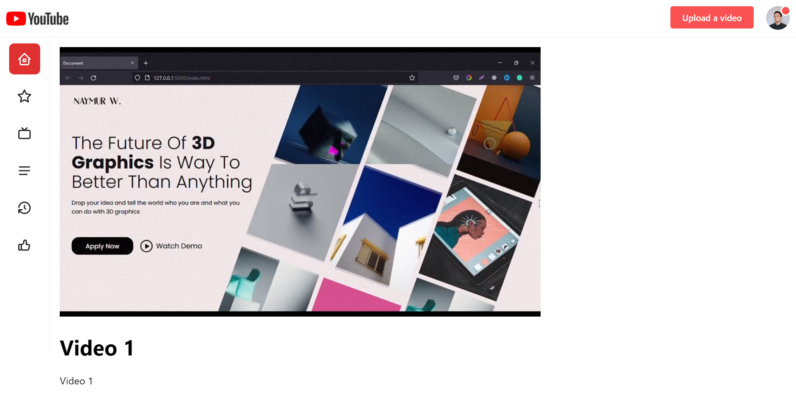

# Youtube clone with Express, MongoDB & NextJs

## Features
1. Register user
2. Login
3. Get current logged in user (me)
4. Upload video
5. Get all videos
6. Stream a video

## Technologies
### Backend
* [Express](https://expressjs.com/)
* [Mongoose](https://www.mongodb.com/)
* [TypeScript](https://www.typescriptlang.org/)
* [argon2](https://www.npmjs.com/package/argon2)
* [busboy](https://www.npmjs.com/package/busboy)
* [pino](https://github.com/pinojs/pino)
* [Zod](https://github.com/colinhacks/zod)

### Frontend
* [Next.js](https://nextjs.org/)
* [Mantine](https://mantine.dev/)
* [TypeScript](https://www.typescriptlang.org/)
* [React Query](https://react-query.tanstack.com/)

## Screenshots

### Login Page

### Register Page

### Home Page

### Add Video Modal

### Add Video Modal Form

### Stream Video Page

